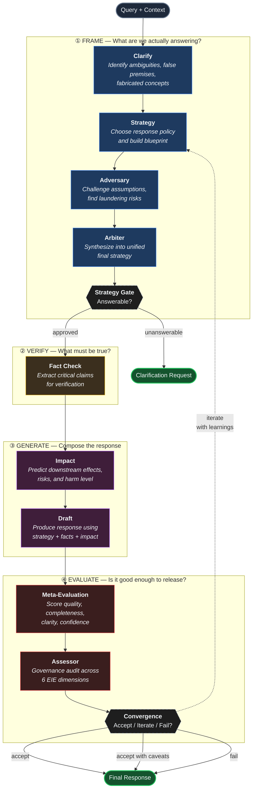

# How IRG Works

The **Iterative Reasoning Graph** is a governed pipeline that turns a query into a verified response through four phases: **Frame**, **Verify**, **Generate**, and **Evaluate**. Each phase can loop back if the governance layer flags insufficient quality.

## Flow

## What each phase buys you

| Phase | Purpose | Why it matters |
|-------|---------|----------------|
| **① Frame** | Decide *what* to answer and *how* before drafting | Catches unanswerable questions, false premises, and fabricated referents before any content is generated |
| **② Verify** | Extract factual claims from the strategy | Creates an auditable list of claims the response will rely on |
| **③ Generate** | Predict impact, then draft | Impact assessment informs the tone and caveats of the draft |
| **④ Evaluate** | Two independent scorers check the draft | Meta-eval assesses quality; Assessor audits governance integrity across EIE dimensions |

## The iteration loop

Convergence is where IRG earns its "iterative" name. If Meta-Evaluation or the Assessor flags problems:

- **Meta-Eval** can request iteration based on execution quality, completeness, or clarity scores
- **Assessor** can override with a governance veto if any of the 6 EIE dimensions falls below the critical floor (0.50) or the overall score is below the release threshold (0.70)

When either triggers iteration, the loop returns to **Strategy** carrying learnings from this pass. The next strategy incorporates that feedback — it doesn't start from scratch.

The loop runs up to `maxIterations` times. If quality still hasn't been reached, Convergence forces an `accept` or `fail` terminal decision rather than looping forever.

## The six EIE dimensions

The Assessor scores every draft across:

1. **Claim-Evidence Alignment** — Are claims grounded in evidence?
2. **Confidence Calibration** — Is certainty warranted by the data?
3. **Scope Discipline** — Did we answer the question without overreach?
4. **Omission Awareness** — What wasn't said that should have been?
5. **Internal Consistency** — Do the parts agree with each other?
6. **Reasoning Transparency** — Is the logic traceable?

The composite EIE score is the primary gate between "ready to release" and "needs another iteration."
